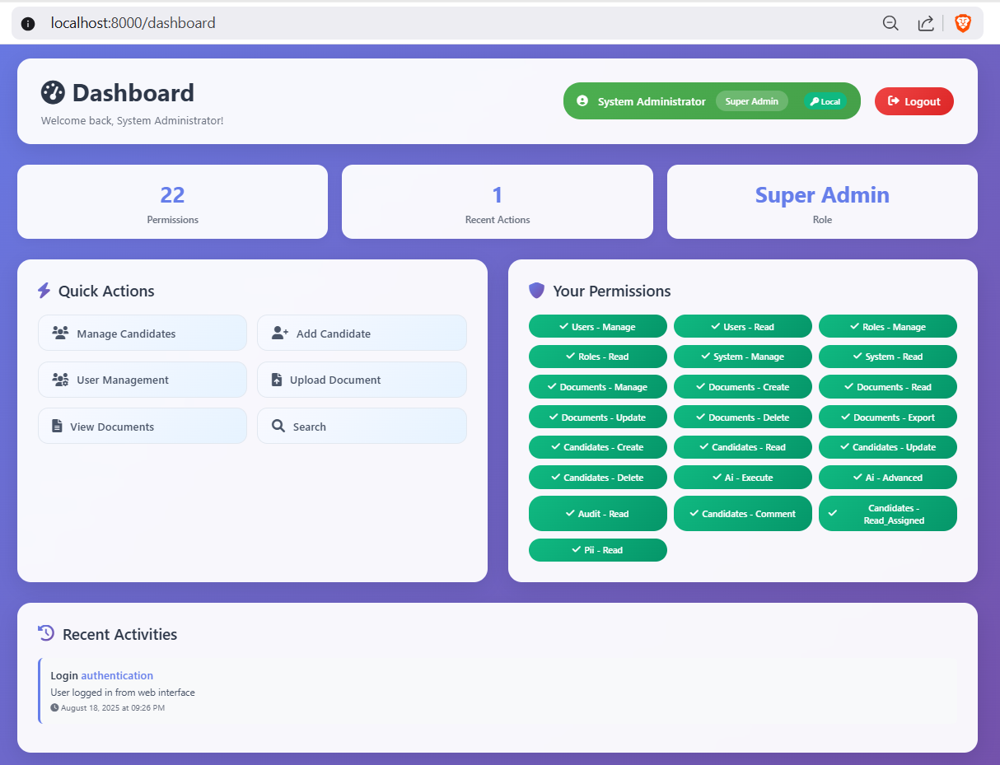
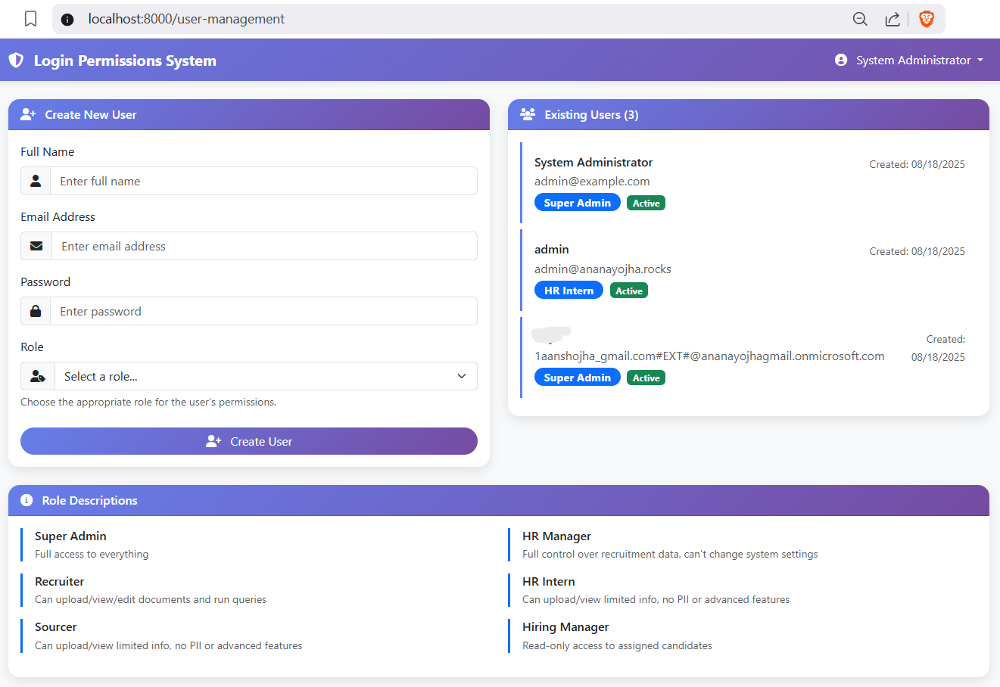
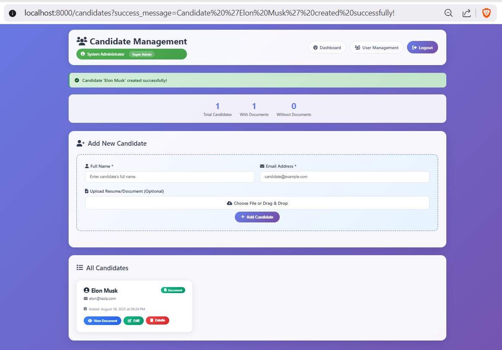

# HR Management System with Enterprise SAML Authentication


A production-ready HR management platform that streamlines candidate tracking and user management with enterprise-grade Azure AD SAML integration. Built for organizations requiring secure, role-based access control and seamless single sign-on capabilities.

## 🌟 [Live Demo](http://localhost:8000)
*Experience the full application with role-based dashboards and SAML authentication*

## 📸 Screenshots

### Dashboard Overview


### User Management Interface


### Candidate Management


## 🎯 Problem & Motivation

Traditional HR systems often lack proper role-based access control and struggle with enterprise authentication integration. I built this solution to address three critical pain points:

1. **Security Gap**: Many HR tools don't properly implement granular permissions
2. **Authentication Complexity**: Integrating with enterprise identity providers is often overcomplicated
3. **User Experience**: Most systems sacrifice usability for security

This project demonstrates my expertise in building secure, scalable web applications with modern authentication patterns and clean, maintainable code architecture.

## 🛠️ Tech Stack

### **Backend**
* **FastAPI** - Modern, high-performance Python web framework
* **SQLAlchemy 2.0** - Advanced ORM with async support
* **PostgreSQL** - Robust relational database
* **Pydantic** - Data validation and settings management
* **Python-JOSE** - JWT token handling and cryptography

### **Authentication & Security**
* **Azure AD SAML 2.0** - Enterprise single sign-on
* **JWT Tokens** - Stateless authentication
* **Passlib + Bcrypt** - Secure password hashing
* **Role-Based Access Control (RBAC)** - Granular permissions

### **Frontend**
* **Jinja2 Templates** - Server-side rendering
* **HTML/CSS/JavaScript** - Responsive web interface
* **Bootstrap** - Modern UI components


## ✨ Features

### **Core Functionality**
* ✅ **Multi-Authentication Support** - Local credentials + Azure AD SAML
* ✅ **Role-Based Access Control** - 6 distinct user roles with granular permissions
* ✅ **Candidate Management** - Full CRUD operations for recruitment data
* ✅ **User Administration** - Complete user lifecycle management
* ✅ **Auto-Generated API Documentation** - Interactive Swagger/OpenAPI docs

### **Security Features**
* ✅ **JWT-Based Sessions** - Stateless, scalable authentication
* ✅ **Password Security** - Bcrypt hashing with salt
* ✅ **SAML 2.0 Integration** - Enterprise-grade SSO
* ✅ **Automatic Role Mapping** - Azure AD groups → Internal roles
* ✅ **Session Management** - Secure token handling

### **User Experience**
* ✅ **Responsive Design** - Mobile-friendly interface
* ✅ **Real-time Validation** - Client-side and server-side checks
* ✅ **Intuitive Navigation** - Role-based menu systems
* ✅ **Error Handling** - Comprehensive user feedback

## 🚀 Getting Started

### Prerequisites
Ensure you have the following installed:
* **Python 3.8+** ([Download](https://python.org/downloads/))
* **PostgreSQL 13+** ([Download](https://postgresql.org/download/))
* **Git** ([Download](https://git-scm.com/downloads))

### Local Setup

1. **Clone the repository**
   ```bash
   git clone https://github.com/AanshOjha/user-hub.git
   cd user-hub
   ```

2. **Create and activate virtual environment**
   ```bash
   # Windows
   python -m venv .venv
   .venv\Scripts\activate
   
   # macOS/Linux
   python3 -m venv .venv
   source .venv/bin/activate
   ```

3. **Install dependencies**
   ```bash
   pip install -r requirements.txt
   ```

4. **Create PostgreSQL database**
   ```bash
   # Using psql
   createdb login_permissions_db
   
   # Or using PostgreSQL command line
   psql -U postgres -c "CREATE DATABASE login_permissions_db;"
   ```

5. **Configure environment variables**
   
   Create a `.env` file in the project root:
   ```bash
   # Copy the example file
   cp .env.example .env
   ```
   
   Update `.env` with your configuration:
   ```env
   # Database Configuration
   DB_HOST=localhost
   DB_NAME=login_permissions_db
   DB_USER=your_db_user
   DB_PASSWORD=your_db_password
   
   # Security
   SECRET_KEY=your-super-secret-key-minimum-32-characters
   ALGORITHM=HS256
   ACCESS_TOKEN_EXPIRE_MINUTES=30
   
   # Default Admin Account
   ADMIN_EMAIL=admin@example.com
   ADMIN_PASSWORD=admin123
   
   # Optional: SAML Configuration (for Azure AD integration)
   SAML_ENABLED=false
   AZURE_TENANT_ID=your_azure_tenant_id
   AZURE_SAML_CERTIFICATE=your_certificate_string
   ```

6. **Initialize database and create admin user**
   ```bash
   python init_db.py
   ```

7. **Run the application**
   ```bash
   uvicorn main:app --reload --host 0.0.0.0 --port 8000
   ```

8. **Access the application**
   * **Main Application**: http://localhost:8000
   * **API Documentation**: http://localhost:8000/docs
   * **Admin Login**: admin@example.com / admin123

## 🔐 User Roles & Permissions

| Role | Dashboard Access | User Management | Candidate Management | Document Access |
|------|-----------------|----------------|---------------------|-----------------|
| **Super Admin** | ✅ Full Access | ✅ Create/Edit/Delete | ✅ Full CRUD | ✅ All Documents |
| **HR Manager** | ✅ HR Dashboard | ✅ View/Edit Users | ✅ Full CRUD | ✅ HR Documents |
| **Recruiter** | ✅ Recruitment View | ❌ No Access | ✅ Create/Edit | ✅ Recruitment Docs |
| **Interviewer** | ✅ Interview Panel | ❌ No Access | ✅ View/Comment | ✅ Interview Notes |
| **Sourcer** | ✅ Sourcing View | ❌ No Access | ✅ Create/View | ❌ Limited Access |
| **HR Intern** | ✅ Basic View | ❌ No Access | ✅ View Only | ❌ No Access |

## 🌐 Azure AD SAML Integration

### Setup Steps

1. **Create Enterprise Application in Azure AD**
   - Navigate to Azure AD → Enterprise Applications
   - Click "New Application" → "Create your own application"

2. **Configure SAML Settings**
   ```
   Entity ID: http://localhost:8000/auth/saml/metadata
   Reply URL: http://localhost:8000/acs
   Sign on URL: http://localhost:8000/auth/saml/login
   ```

3. **Add Claims Configuration**
   ```
   Name: http://schemas.microsoft.com/ws/2008/06/identity/claims/role
   Source: Directory extension
   ```

4. **Role Mapping Configuration**
   ```
   Azure AD Group → Internal Role
   hr-manager → HR Manager
   hr-recruiter → Recruiter
   hr-interviewer → Interviewer
   hr-sourcer → Sourcer
   hr-intern → HR Intern
   super-admin → Super Admin
   ```

## 🧪 Challenges & Learnings

### **Challenge 1: SAML Integration Complexity**
**Problem**: Integrating Azure AD SAML while maintaining local authentication was complex due to different user creation flows.

**Solution**: Implemented a dual authentication strategy with automatic user provisioning. Created separate schemas for SAML vs local users and unified them at the database level.

**Learning**: This taught me about enterprise authentication patterns and the importance of flexible user management systems.

### **Challenge 2: Role-Based Access Control**
**Problem**: Designing a scalable RBAC system that could handle both Azure AD groups and local roles without code duplication.

**Solution**: Built a middleware-based permission system using FastAPI dependencies. Created a unified role mapping service that translates Azure AD groups to internal permissions.

**Learning**: Understanding enterprise security patterns and the critical importance of proper authorization in HR systems.

### **Challenge 3: Database Performance with Complex Queries**
**Problem**: As the candidate database grew, complex filtering and search queries became slow.

**Solution**: Implemented SQLAlchemy 2.0 with optimized queries, proper indexing, and efficient eager loading strategies.

**Learning**: Database optimization techniques and the importance of query planning in production applications.

## 📁 Project Structure

```
├── main.py              # FastAPI application and routes
├── database.py          # SQLAlchemy models and database connection
├── crud.py             # Database operations and business logic
├── auth.py             # JWT authentication and local auth logic
├── saml_auth.py        # Azure AD SAML integration
├── schemas.py          # Pydantic models for API validation
├── config.py           # Application settings and configuration
├── init_db.py          # Database initialization and admin user creation
├── requirements.txt    # Python dependencies
├── .env.example        # Environment variables template
├── templates/          # Jinja2 HTML templates
│   ├── login.html      # Login page with SAML/local options
│   ├── dashboard.html  # Role-based dashboard
│   ├── candidates.html # Candidate management interface
│   └── user_management.html # Admin user management
└── documents/          # File upload storage
```

## 🔗 API Endpoints

### **Authentication**
* `POST /token` - Local login with email/password
* `GET /auth/saml/login` - Initiate SAML authentication
* `POST /acs` - SAML assertion consumer service

### **User Management**
* `GET /users/` - List all users (Admin only)
* `POST /users/` - Create new user
* `PUT /users/{user_id}` - Update user details
* `DELETE /users/{user_id}` - Deactivate user

### **Candidate Management**
* `GET /candidates/` - List candidates (role-based filtering)
* `POST /candidates/` - Create new candidate
* `PUT /candidates/{candidate_id}` - Update candidate
* `DELETE /candidates/{candidate_id}` - Remove candidate

### **Documentation**
* `GET /docs` - Interactive API documentation (Swagger UI)
* `GET /redoc` - Alternative API documentation

## 📄 License

This project is licensed under the **MIT License** - see the [LICENSE](LICENSE) file for details.

---

**Built with ❤️ by [Aansh Ojha](https://github.com/AanshOjha)** | *Demonstrating enterprise-grade Python development skills*
